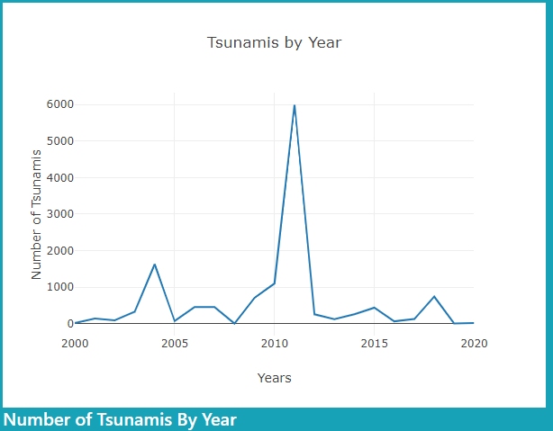
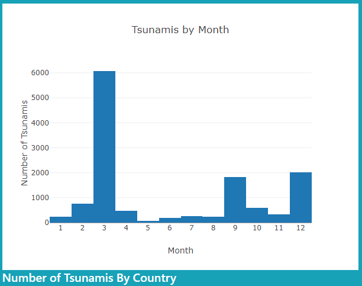

# Tsunami-Project

# Project 2 - Data Visualization
# Tsunami Dashboard

### Introduction
We are interested in developing a dashboard to visualize tsunami data for events that occurred during 2000-2020.
We chose tsunamis because most natural disaster dashboards focus on earthquakes. While tsunamis are usually caused by earthquakes, we thought it would be interes/ng to look at data that is tsunami-specific, including how far away effects were observed compared to the source loca/on, water height, injuries, and damages.

   

### Dataset
Tsunami data is available on the National Oceanic and Atmospheric Administra/on (NOAA) website: https://www.ngdc.noaa.gov/hazel/view/hazards/tsunami/runup-search/

We are also web scraping the latest tsunami warning, advisory, watch, or threat headline from https://www.tsunami.gov/

### Technology Stack
* Server side
  * Flask
  * MongoDB
  * Python

* Client side
  * HTML
  * JavaScript
  * Bootstrap CSS
  * Leaflet
  * Plotly
  * DataTables / jQuery
